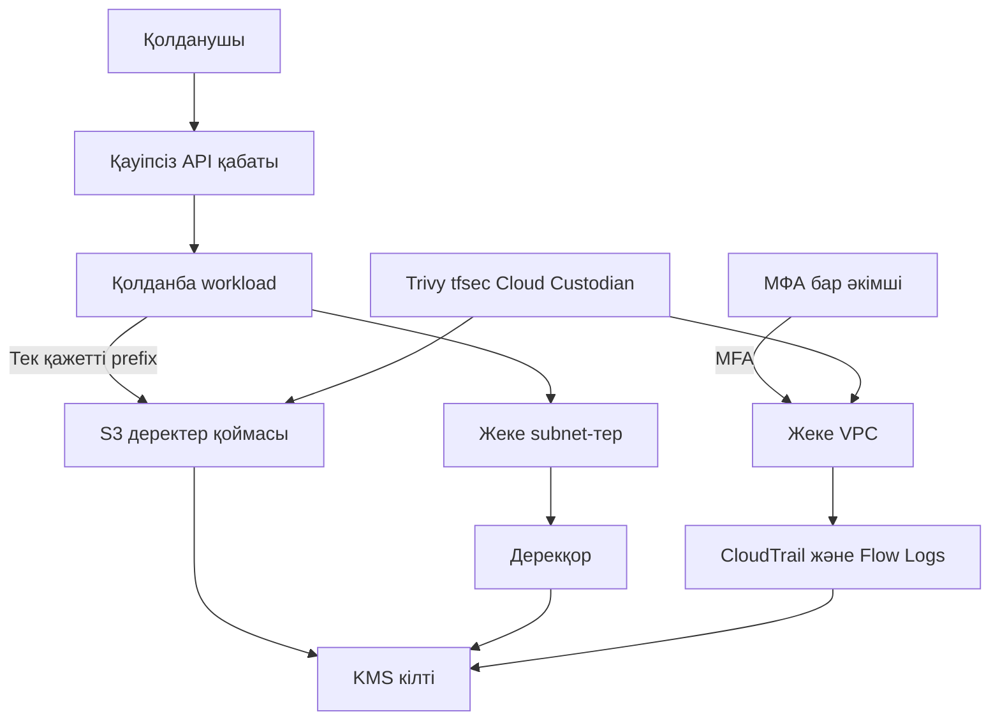
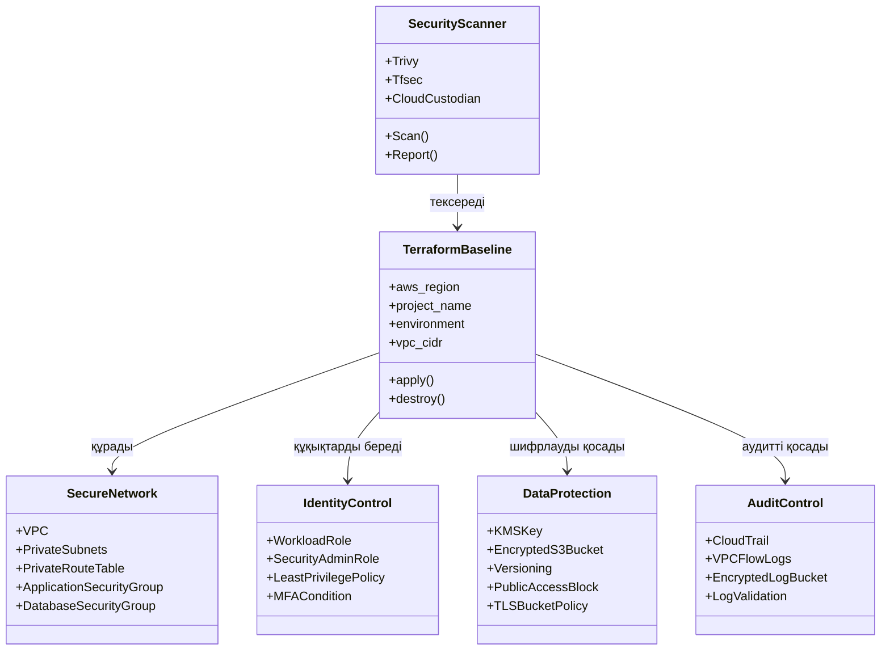
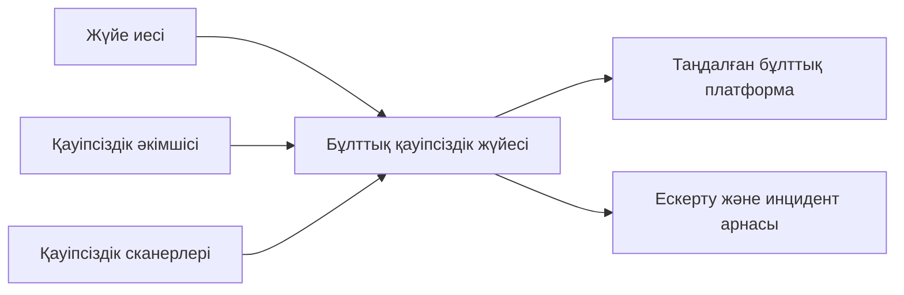
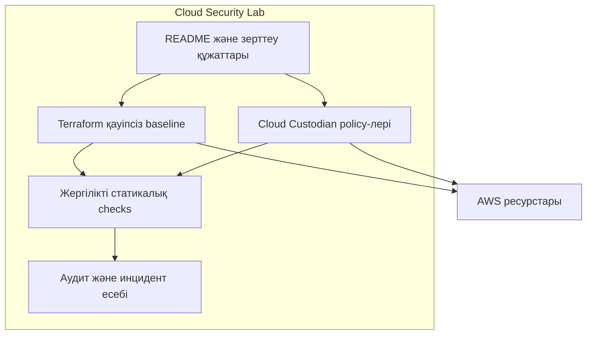
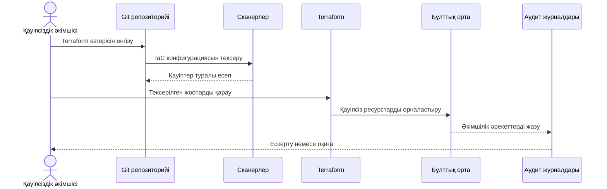
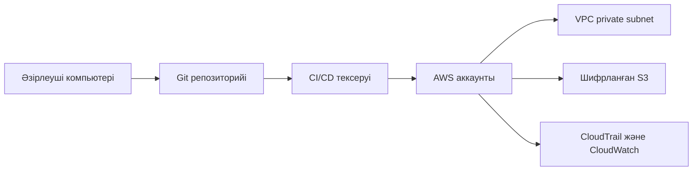

# Бұлттық ортадағы ақпараттық қауіпсіздік зертханасы

Бұл жоба бастапқы тапсырмадағы 2-тақырыпты орындайды: бұлттық платформалардың қауіптерін зерттеу, корпоративтік деректерді қорғау бейінін әзірлеу және қауіпсіз инфрақұрылымның жұмыс істейтін прототипін көрсету.

Негізгі практикалық үлгі ретінде AWS архитектурасы алынды. Салыстыруда Azure, Yandex Cloud және OpenStack қарастырылады. Жоба нақты бұлт аккаунтына құпия кілтсіз жұмыс істейді: Terraform конфигурациясы мен қауіпсіздік policy-лері жергілікті тексеріледі.

## Қорғауға дайын соңғы нәтиже

Жоба соңында мына материалдар дайын болады:

- бұлттық қауіптер мен тәуекелдер матрицасы;
- AWS үшін қауіпсіз желі және сақтау архитектурасы;
- IAM least privilege және MFA саясаты;
- сақтау кезінде және тасымалдау кезінде шифрлау үлгісі;
- Terraform түріндегі Infrastructure as Code конфигурациясы;
- Trivy, tfsec және Cloud Custodian құралдарын қолдану сценарийлері;
- статикалық аудит тесті;
- инцидентке әрекет ету жоспары;
- UML, C4, sequence және deployment диаграммалары.

## Тапсырма талаптарының орындалуы

| Тапсырма бөлігі | Жоба нәтижесі |
|---|---|
| Қауіп-қатерлерді талдау | `docs/threat-matrix.md` файлындағы 12 қауіптен тұратын матрица |
| Бұлттық модельдерді салыстыру | README-дегі AWS, Azure, Yandex Cloud және OpenStack кестесі |
| IAM және RBAC/ABAC | MFA талап ететін әкімші рөлі және шектеулі workload рөлі |
| Шифрлау | KMS, S3 SSE-KMS, CloudTrail SSE-KMS және TLS талабы |
| Практикалық аудит | `tests/security_check.sh`, Trivy, tfsec және Cloud Custodian командалары |
| Инцидентке әрекет ету | `docs/incident-response.md` файлындағы бес кезеңді жоспар |
| Қорғау материалдары | Осы README ішіндегі диаграммалар, кестелер және түсіндірмелер |

## 1. Қауіп-қатерлерді талдау

Талдау OWASP API Security Top 10 және MITRE ATT&CK Cloud негіздеріне сүйенеді. OWASP API жобасы API-дағы авторизация, аутентификация, SSRF, ресурсты шектеу және қауіпсіздік конфигурациясы мәселелерін сипаттайды. MITRE ATT&CK Cloud шабуылшының бұлттағы әрекетін тактика және техника түрінде жүйелейді.

Негізгі қауіптер:

| Қауіп | Ықтимал салдар | Негізгі бақылау |
|---|---|---|
| IAM құқықтарының артық берілуі | Деректердің оқылуы немесе өзгертілуі | Least privilege, MFA, бөлек рөлдер |
| Public S3 bucket | Құпия ақпараттың жария болуы | Public Access Block, bucket policy |
| Құпия кілттің кодқа жазылуы | Аккаунттың басып алынуы | Secret Manager, secret scan |
| Ашық желі порты | Рұқсатсыз қосылу | Private subnet, тар security group |
| Шифрлаудың болмауы | Деректердің ұсталып қалуы | KMS және TLS |
| Аудит журналының болмауы | Инцидентті зерттей алмау | CloudTrail, Flow Logs |
| Осал компонент | Қызметтің бұзылуы | Нұсқаларды бекіту және Trivy |
| Ресурсты заңсыз пайдалану | Қаржылық шығын | Лимит, мониторинг, ескерту |

Толық матрица: [`docs/threat-matrix.md`](docs/threat-matrix.md).

Архитектураның қабаттары: [`docs/architecture.md`](docs/architecture.md).

## 2. Платформаларды салыстыру

| Критерий | AWS | Azure | Yandex Cloud | OpenStack |
|---|---|---|---|---|
| IAM қызметі | IAM, Organizations | Entra ID, RBAC | IAM, cloud roles | Keystone, RBAC |
| Желілік оқшаулау | VPC, security groups | VNet, NSG | VPC, security groups | Neutron |
| Кілттерді басқару | KMS | Key Vault | Lockbox | Barbican |
| Аудит | CloudTrail, CloudWatch | Activity Log, Monitor | Audit Trails | Audit және service logs |
| Terraform қолдауы | Жетілген | Жетілген | Провайдер арқылы | Провайдер арқылы |
| Бұл жобадағы рөлі | Негізгі үлгі | Салыстыру | Салыстыру | Жеке cloud баламасы |

Практикалық конфигурация AWS үшін таңдалды, себебі IAM, KMS, CloudTrail, VPC және S3 бақылауларын бір архитектурада көрсетуге ыңғайлы. Бұл басқа платформалар қауіпсіз емес дегенді білдірмейді; атаулары мен басқару құралдары өзгеше.

## 3. Қауіпсіздік архитектурасы



### Қорғаныс принциптері

1. **Least privilege:** workload тек `tenant-a/*` prefix ішіндегі S3 объектілерін оқи алады.
2. **Жеке желі:** subnet-терге жалпы интернет ingress ережесі берілмейді.
3. **Defense in depth:** IAM, security group, bucket policy, KMS және аудит бір-бірін толықтырады.
4. **Secure by default:** S3 public access бұғатталған, versioning және TLS талабы қосылған.
5. **Accountability:** CloudTrail және VPC Flow Logs кейінгі зерттеу үшін сақталады.

## 4. UML класс диаграммасы



## 5. C4 контекст диаграммасы



## 6. C4 контейнер диаграммасы



## 7. Sequence диаграммасы



## 8. Орналастыру диаграммасы



## 9. Terraform конфигурациясы

Негізгі файлдар `terraform/` каталогында:

| Файл | Міндеті |
|---|---|
| `versions.tf` | Terraform және AWS provider нұсқаларын бекіту |
| `variables.tf` | Аймақ, орта және VPC параметрлері |
| `main.tf` | VPC және Flow Logs негізі |
| `network.tf` | Жеке subnet және security group ережелері |
| `iam.tf` | Workload, әкімші және MFA рөлдері |
| `data-protection.tf` | KMS, S3 шифрлауы және public access қорғанысы |
| `audit.tf` | Шифрланған аудит bucket-і және CloudTrail |
| `outputs.tf` | Қауіпсіз идентификаторларды шығару |

Құпия кілттер Terraform файлдарында сақталмайды. AWS credentials Terraform-ға орта айнымалысы немесе стандартты AWS credentials профилі арқылы берілуі керек.

## 10. Практикалық аудит

### Жергілікті қауіпсіздік тексеруі

Бұл ортада Terraform, Trivy және tfsec орнатылмаса да, репозиторийде негізгі қауіпсіздік қасиеттерін тексеретін скрипт бар:

```bash
cd cloud_security
bash tests/security_check.sh
```

Барлық қолжетімді тексеруді бір командамен орындау үшін:

```bash
bash scripts/run_audit.sh
```

Скрипт public ingress, hardcoded secret, S3 public access, KMS rotation, TLS талабы және MFA шартын тексереді.

### Құралдарды іске қосу

```bash
trivy config terraform/
tfsec terraform/
custodian run policies/cloud-custodian.yml --output-dir reports/custodian-output
```

Нәтижелерді `reports/security-scan-report.md` файлына нақты іске қосылған күнмен және құрал нұсқасымен тіркеу керек.

## 11. Қауіпсіздік құралдарын салыстыру

| Құрал | Не тексереді | Ең тиімді қабаты |
|---|---|---|
| Trivy | IaC, контейнер, тәуелділік және secret | Код пен CI/CD |
| tfsec | Terraform misconfiguration | IaC pull request-і |
| Cloud Custodian | Нақты cloud resource күйі | AWS runtime аудиті |

Толық салыстыру: [`docs/tool-comparison.md`](docs/tool-comparison.md).

## 12. Инцидентке әрекет ету

Жоспар бес негізгі кезеңнен тұрады:

1. Дайындық: журнал, MFA, backup және байланыс арналарын дайындау.
2. Анықтау: оқиғаны тіркеу және дәлелдерді сақтау.
3. Оқшаулау: кілтті өшіру, сессияны тоқтату, ресурсты желіден бөлу.
4. Жою және қалпына келтіру: осалдықты түзету, кілтті ауыстыру, backup тексеру.
5. Сабақ алу: себепті анықтау және бақылауларды күшейту.

Толық нұсқа: [`docs/incident-response.md`](docs/incident-response.md).

## 13. Жобаның файлдық құрылымы

```text
cloud_security/
├── README.md
├── .gitignore
├── terraform/
│   ├── versions.tf
│   ├── variables.tf
│   ├── main.tf
│   ├── network.tf
│   ├── iam.tf
│   ├── data-protection.tf
│   ├── audit.tf
│   ├── outputs.tf
│   └── terraform.tfvars.example
├── policies/
│   └── cloud-custodian.yml
├── tests/
│   └── security_check.sh
├── scripts/
│   └── run_audit.sh
├── docs/
│   ├── threat-matrix.md
│   ├── architecture.md
│   ├── incident-response.md
│   ├── tool-comparison.md
│   └── superpowers/
└── reports/
    └── security-scan-report.md
```

## 14. Қорғау кезінде көрсетілетін сценарий

1. README арқылы мәселе мен архитектураны түсіндіру.
2. `docs/threat-matrix.md` файлы арқылы жоғары тәуекелдерді көрсету.
3. `terraform/` каталогынан private subnet, IAM, MFA, KMS және S3 қорғанысын көрсету.
4. `bash tests/security_check.sh` командасын орындау.
5. Trivy немесе tfsec орнатылған болса, сканер нәтижесін көрсету.
6. Бір қауіп мысалын таңдап, оны қандай бақылау жабатынын түсіндіру.
7. `docs/incident-response.md` арқылы сол қауіп анықталғаннан кейінгі әрекет ретін айту.

## 15. Пайдаланылған ресми әдістемелік дереккөздер

- [OWASP API Security Top 10 2023](https://owasp.org/API-Security/editions/2023/en/0x00-header/)
- [MITRE ATT&CK Enterprise Cloud Matrix](https://attack.mitre.org/matrices/enterprise/cloud/)
- [Trivy IaC misconfiguration scanning](https://trivy.dev/latest/docs/scanner/misconfiguration/)
- [Cloud Custodian құжаттамасы](https://cloudcustodian.io/docs/)
- [Terraform құжаттамасы](https://developer.hashicorp.com/terraform/docs)

## Қорытынды

Бұл зертхана екінші тапсырманың теориялық және практикалық бөлігін біріктіреді. Нәтижесінде бұлттық қауіптерді анықтайтын матрица, қауіпсіз AWS архитектурасы, Terraform арқылы басқарылатын қорғаныс шаралары, аудит құралдары және инцидентке әрекет ету жоспары дайын болады. Жоба нақты құпия кілттерді немесе міндетті ақылы cloud deployment-ті талап етпей, қауіпсіздік принциптерін көрсетуге мүмкіндік береді.
