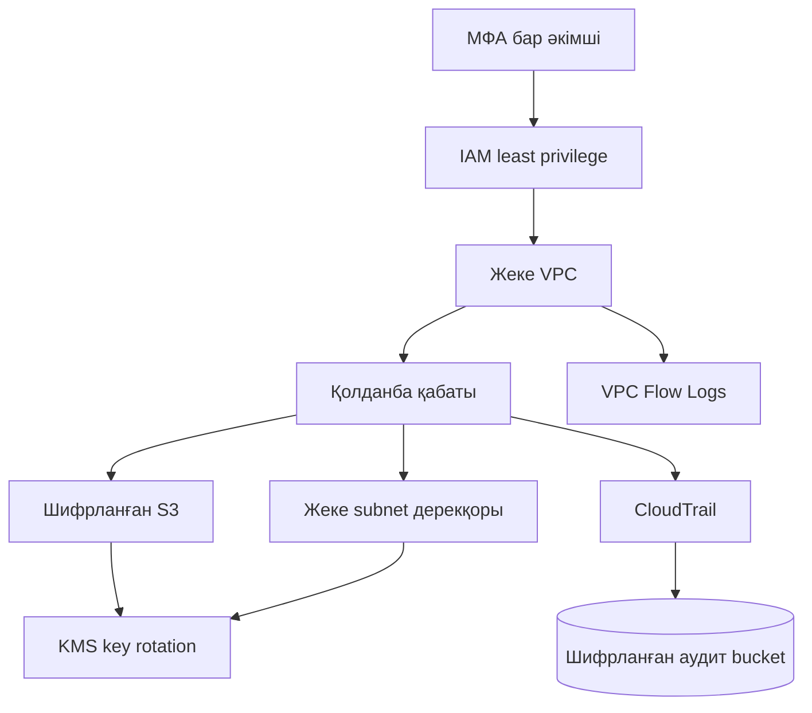

# Бұлттық қауіпсіздік архитектурасы

## Негізгі қабаттар

| Қабат | Компонент | Қауіпсіздік бақылауы |
|---|---|---|
| Қолжетімділік | IAM, workload role, security admin role | Least privilege және MFA |
| Желі | VPC, private subnet, security group | Интернеттен тікелей ingress жоқ |
| Деректер | S3, KMS | SSE-KMS, versioning, public access block |
| Аудит | CloudTrail, VPC Flow Logs, CloudWatch | Multi-region журналдау, log validation |
| Валидация | Trivy, tfsec, Cloud Custodian | IaC және cloud resource аудиті |

## Компоненттер арасындағы байланыс

## Қауіпсіздік шешімдерінің түсіндірмесі

- Желі деңгейінде тек жеке subnet-тер қолданылады. Дерекқордың ingress ережесі тек қолданба security group-ынан 5432 портына рұқсат береді.
- IAM workload рөлі барлық аккаунтқа емес, тек `tenant-a/*` S3 prefix-іне оқуға рұқсат алады.
- S3 bucket-терде public access толық блокталады, versioning қосылады және TLS жоқ сұраулар қабылданбайды.
- Бір KMS кілті S3 және аудит журналдарын қорғауға арналған. Кілттің автоматты ротациясы қосылған.
- CloudTrail барлық аймақтық және жаһандық әрекеттерді тіркейді, ал VPC Flow Logs желілік ағындарды зерттеуге мүмкіндік береді.
