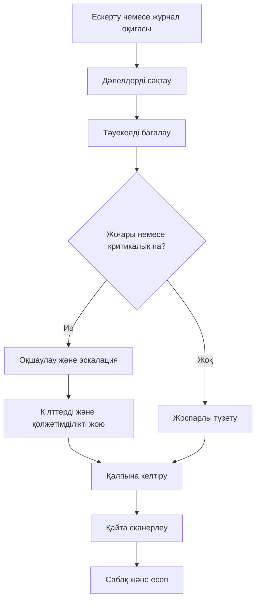

# Бұлттық инцидентке әрекет ету жоспары

Бұл жоспар рұқсатсыз кіру, құпия кілттің таралуы, ашық S3 bucket немесе күдікті ресурстардың жасалуы сияқты оқиғаларға арналған.

## 1. Дайындық

- CloudTrail және VPC Flow Logs барлық аймақта қосылады.
- Журналдар бөлек, шифрланған және public access жабылған S3 bucket-ке жазылады.
- Әкімші рөлі MFA арқылы ғана қабылданады.
- Байланыс арналары, жауапты адамдар және эскалация тәртібі алдын ала жазылады.
- Terraform өзгерістері тек pull request және қауіпсіздік сканерінен кейін қабылданады.

## 2. Анықтау және тіркеу

1. CloudTrail, CloudWatch, GuardDuty немесе сканер ескертуін қабылдау.
2. Оқиғаның уақытын, аккаунтын, аймағын, ресурс идентификаторын және бастапқы журналын сақтау.
3. Оқиға түрін анықтау: IAM, сақтау, желі, қолданба немесе дерек тұтастығы.
4. Тәуекел деңгейін бағалау: төмен, орташа, жоғары немесе критикалық.

## 3. Оқшаулау

- Құпия кілт таралса, оны дереу жарамсыз ету және жаңасын шығару.
- Күдікті IAM сессияларын тоқтату, артық рөлдерді уақытша ажырату.
- Күдікті security group ingress ережелерін жабу.
- Зақымдалған VM немесе контейнерді желіден бөлу, бірақ дәлелдерді жоймау.
- S3 bucket-ті public access block арқылы жабу.

## 4. Жою және қалпына келтіру

1. Осал компонентті жаңарту немесе қайта орналастыру.
2. Зиянды ресурстарды Terraform арқылы белгілі күйге қайтару.
3. Деректер тұтастығын versioning және backup арқылы тексеру.
4. Кілттерді, токендерді және парольдерді ротациялау.
5. Қызметті тек қауіпсіздік тексеруінен кейін қайта қосу.

## 5. Сабақ алу

- Негізгі себепті анықтау.
- Қай бақылау жеткіліксіз болғанын жазу.
- Қауіптер матрицасын жаңарту.
- Terraform және сканер тестіне жаңа ереже қосу.
- Инцидент есебін, уақыт кестесін және қабылданған шараларды сақтау.

