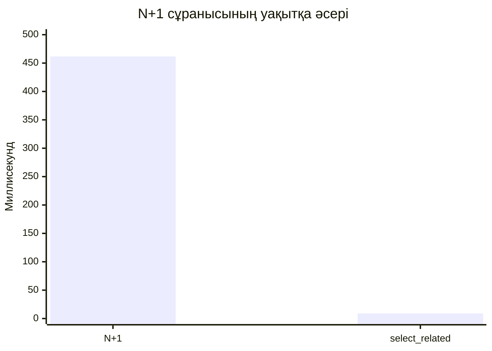
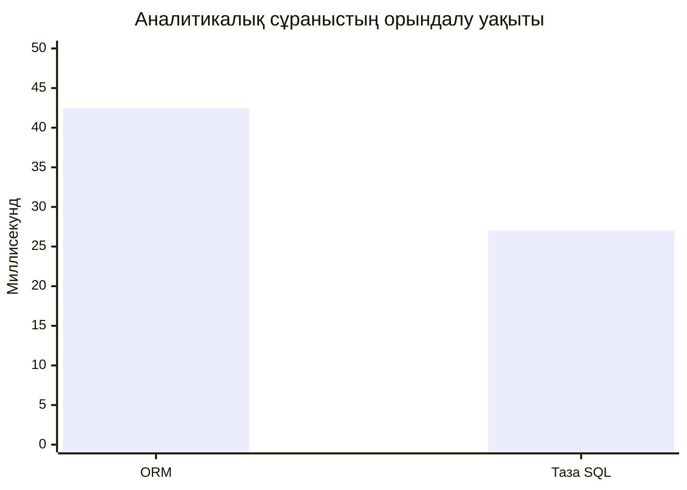
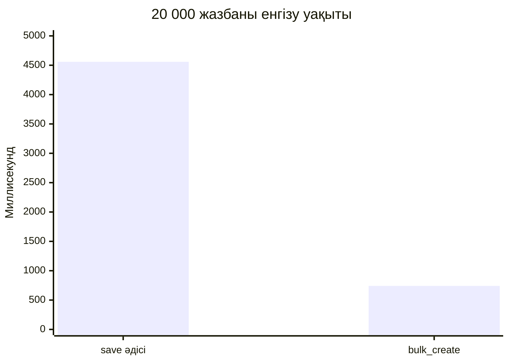

# ORM өнімділігі, аналитика және деректер тұтастығы бойынша есеп

## Орта

- Тіл: Python 3.12
- Фреймворк: Django 6.1.1
- Деректер базасы: SQLite
- Деректер көлемі: 100 автор, 1 000 кітап, 20 бөлім, 12 000 қызметкер

## 1. N+1 мәселесі

`Book.objects.all()` арқылы алынған әр кітаптың `author.name` қасиетін циклде оқу N+1 анти-паттернін тудырды. Кітаптар үшін бір сұраныс, әр авторды алу үшін 1 000 жеке сұраныс жіберілді.

| Нұсқа | SQL сұраныс саны | Уақыт, мс |
| --- | ---: | ---: |
| Оңтайландырусыз | 1 001 | 461.67 |
| `select_related("author")` | 1 | 8.99 |



Алғашқы SQL сұраныстары:

```sql
SELECT "analytics_book"."id", "analytics_book"."title", "analytics_book"."author_id"
FROM "analytics_book";

SELECT "analytics_author"."id", "analytics_author"."name"
FROM "analytics_author" WHERE "analytics_author"."id" = 1 LIMIT 21;
```

Оңтайландырылған SQL:

```sql
SELECT ... FROM "analytics_book"
INNER JOIN "analytics_author"
ON ("analytics_book"."author_id" = "analytics_author"."id");
```

Қорытынды: `select_related` байланысты авторды `JOIN` арқылы бірден алып, сұраныс санын 1001-ден 1-ге азайтты. Уақыт шамамен 51 есе қысқарды.

## 2. Күрделі аналитикалық сұраныс: ORM және таза SQL

Есеп — әр бөлімдегі ең жоғары жалақысы бар үш қызметкерді, бөлімнің орташа жалақысын және рейтингін алу. Сұраныста `AVG() OVER (PARTITION BY ...)` және `DENSE_RANK()` терезелік функциялары бар.

| Әдіс | Жол саны | Уақыт, мс | Шыңдық жад, КиБ |
| --- | ---: | ---: | ---: |
| Django ORM | 60 | 42.46 | 312.8 |
| Таза SQL | 60 | 27.02 | 39.0 |



ORM нұсқасы модель атауларын қолданатындықтан қауіпсіз және күнделікті сұраныстарда оқылуы жеңіл. Алайда Django терезелік сүзгісін іске асыру үшін қосымша ішкі сұраныс жасады. Таза SQL күрделі аналитикада нақты орындалатын пішінді толық бақылауға, артық бағандарды алмауға және ДБ-ға тән мүмкіндіктерді пайдалануға ыңғайлы. Сондықтан ерекше CTE, күрделі терезелік функциялар немесе нақты орындау жоспары қажет болғанда ORM тиімсіз болуы мүмкін.

## 3. Миграциялар, транзакциялар және жаппай енгізу

`0001_initial.py` миграциясы `Book.author` және `Employee.department` үшін сыртқы кілттерді, сондай-ақ құрамдас индекстерді жасайды. Тексеру пәрмені:

```powershell
python manage.py sqlmigrate analytics 0001
```

Құлыптау үшін екі шешім жазылды:

- пессимистік құлыптау: `select_for_update()` — транзакция ішінде жолды қорғайды;
- оптимистік құлыптау: `version` өрісі бар шартты `UPDATE` — басқа сессия өзгерткен деректі анықтайды.

SQLite жолдық құлыптауды толық қолдамайды, сондықтан жарыс жағдайын шынайы тексеру үшін PostgreSQL қажет. PostgreSQL-де `SERIALIZABLE` деңгейі ең қатаң қорғаныс береді, ал оптимистік құлыптау жоғары бәсекелестіксіз сценарийде күту уақытын қысқартады.

20 000 жазбаны енгізу өлшемі:

| Әдіс | Уақыт, мс |
| --- | ---: |
| Циклдегі `save()` | 4557.99 |
| `bulk_create()` | 741.42 |



`bulk_create()` 6.15 есе жылдам болды. Себебі ол көптеген жеке `INSERT` орнына топтық енгізу жасайды. Бірақ бұл әдіс әр объектінің `save()` логикасы мен сигналдарын шақырмайды; бизнес-логика қажет болғанда оны ескеру керек.

## Қорытынды

ORM модельдер, байланыстар, миграциялар және стандартты CRUD үшін өнімді әрі қауіпсіз. Байланысқан объектілерді көп мөлшерде оқығанда `select_related`/`prefetch_related` қолданылмаса, N+1 өнімділікті күрт төмендетеді. Күрделі аналитикада және ДБ-ға тән мүмкіндіктерде таза SQL не гибридті тәсіл орынды.
