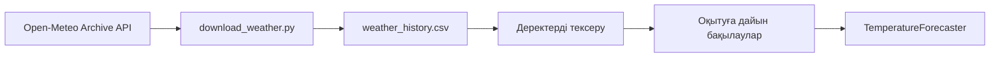
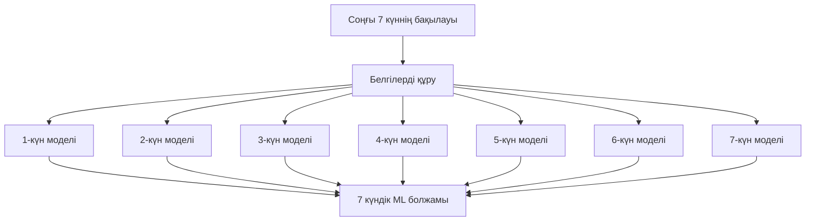
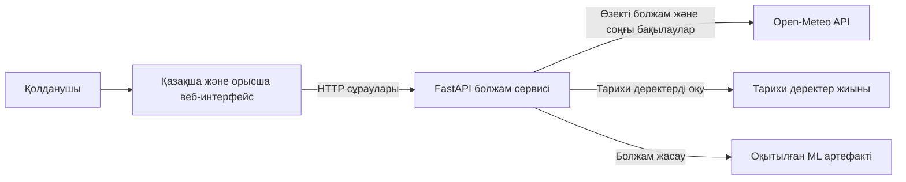
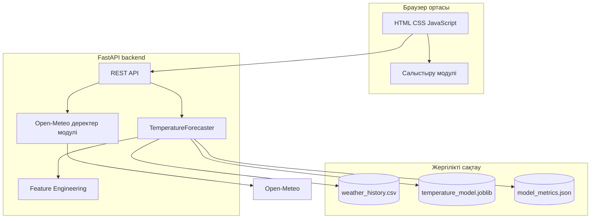
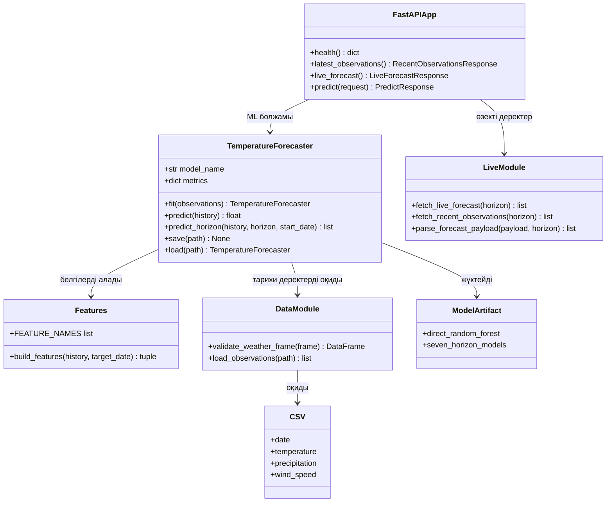
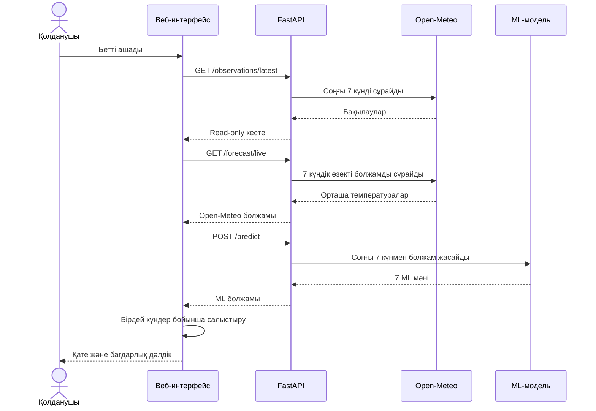
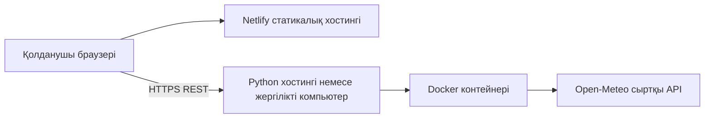

# Қызылорда қаласына арналған ауа райын болжаудың зияткерлік жүйесі

Бұл жоба машиналық оқыту әдістері арқылы Қызылорда қаласының ауа температурасын 7 күнге болжауға арналған. Жүйе бір бетте екі нәтижені көрсетеді: Open-Meteo сервисінің өзекті болжамы және тарихи деректермен оқытылған біздің ML-модельдің болжамы.

Бұл README файл жобаның таныстырылымы ретінде дайындалды. Мұнда жобаның мақсаты, деректер жиыны, модельдеу тәсілі, жүйе архитектурасы, UML/C4 диаграммалары, API және іске қосу қадамдары берілген.

## 1-тақырыптың тапсырмасымен байланысы

Бастапқы тапсырмадағы бірінші тақырыптың мақсаты — уақыттық қатарлар немесе кестелік деректер негізінде мақсатты көрсеткіштерді болжайтын толық циклді зияткерлік жүйе әзірлеу және оны валидациялау.

Жобада осы талаптар мынадай түрде орындалды:

| Талап | Жобадағы іске асырылуы |
|---|---|
| Деректерді жинау | Open-Meteo Archive API арқылы Қызылорда бойынша тарихи деректер жүктеледі |
| Алдын ала өңдеу | Деректер тексеріледі, күндер реттеледі, қайталанатын күндер жойылады, бос мәндер қабылданбайды |
| Белгілерді жобалау | Температура лагтары, 7 күндік орташа мән, жауын-шашын, жел және маусымдық белгілер құрылады |
| Модельдеу | Әрбір болжам көкжиегіне арналған 7 Random Forest регрессоры оқытылады |
| Валидация | MAE, RMSE және R² метрикалары есептеледі |
| Жүйе архитектурасы | Frontend, FastAPI backend, ML модулі және Open-Meteo сервистері бөлінген |
| Деплоймент | Frontend Netlify-ге, backend Python қолдайтын бөлек ортаға орналастырылады |
| Прототип | FastAPI API және қазақша/орысша веб-интерфейс жұмыс істейді |

Екінші тақырып — бұлттық ортадағы ақпараттық қауіпсіздік — осы weather_forecast жобасының құрамына кірмейді.

## 2. Жобаның мақсаты

Жүйе соңғы 7 күннің ауа райы бақылауларын пайдаланып, келесі 7 күннің орташа температурасын болжайды. Қолданушы үшін деректер кестесі тек оқуға арналған, ал болжам нәтижелері түсінікті түрде салыстырылады.

Жүйенің негізгі міндеттері:

- Қызылорда бойынша нақты тарихи деректер жиынын қолдану;
- ауа райы деректерін тексеру және дайындау;
- уақыттық қатардан машиналық оқыту белгілерін құру;
- 1–7 күндік болжамдарды бөлек есептеу;
- Open-Meteo болжамын біздің ML нәтижесімен салыстыру;
- абсолюттік қателікті және бағдарлық дәлдікті әр күнге көрсету;
- жұмыс істейтін веб-прототип ұсыну.

## 3. Деректер жиыны

### Тарихи деректер

Оқытуға арналған деректер `backend/data/weather_history.csv` файлында сақталған.

| Сипаттама | Мәні |
|---|---|
| Орналасқан жер | Қызылорда, Қазақстан |
| Ендік | 44.85 |
| Бойлық | 65.50 |
| Уақыт аралығы | 2016-01-01 – 2025-12-31 |
| Бақылаулар саны | 3 653 күн |
| Негізгі мақсатты көрсеткіш | Күндік орташа температура, °C |
| Дерек көзі | Open-Meteo Archive API |

### Деректер бағандары

| Баған | Мағынасы | Өлшем бірлігі |
|---|---|---|
| `date` | Бақылау күні | YYYY-MM-DD |
| `temperature` | Күндік орташа температура | °C |
| `precipitation` | Күндік жауын-шашын мөлшері | мм |
| `wind_speed` | Желдің максималды жылдамдығы | км/сағ |

Веб-интерфейс іске қосылған кезде соңғы 7 толық күннің бақылауы Open-Meteo арқылы қайта алынады. Бұл кестеде ескі немесе алдын ала енгізілген демонстрациялық мәндердің орнына өзекті деректер көрсетілуін қамтамасыз етеді.

### Деректерді жинау диаграммасы



## 4. Алдын ала өңдеу

`backend/weather_forecast/data.py` модулі келесі әрекеттерді орындайды:

1. Міндетті бағандардың бар-жоғын тексереді.
2. Күндерді бір форматқа келтіреді.
3. Сандық бағандарды сандық типке түрлендіреді.
4. Бос немесе қате мәндерді қабылдамайды.
5. Жауын-шашын мен жел жылдамдығының теріс мәндерін қабылдамайды.
6. Бақылауларды күн бойынша сұрыптайды.
7. Қайталанатын күндерді алып тастайды.

Болжау кезінде болашақ ауа райы мәндері белгілерді құруға қолданылмайды. Модель тек берілген соңғы бақылаулар мен мақсатты күннің күнтізбелік белгілерін пайдаланады.

## 5. Белгілерді жобалау

Әрбір болжам үшін соңғы 7 күннен мына белгілер құрылады:

| Белгі | Түсіндірме |
|---|---|
| `temperature_lag_1` | Соңғы күннің температурасы |
| `temperature_lag_7` | 7 күн бұрынғы температура |
| `temperature_mean_7` | Соңғы 7 күннің орташа температурасы |
| `precipitation_lag_1` | Соңғы бақылаудағы жауын-шашын мәні |
| `wind_speed_lag_1` | Соңғы бақылаудағы жел жылдамдығы |
| `day_of_year_sin` | Жыл ішіндегі маусымдық циклдің синус белгісі |
| `day_of_year_cos` | Жыл ішіндегі маусымдық циклдің косинус белгісі |

Маусымдық белгілер қаңтар мен желтоқсан сияқты жыл соңына жақын күндердің бір-біріне жақын екенін модельге көрсету үшін синус және косинус арқылы есептеледі.

## 6. Машиналық оқыту моделі

Жобада `scikit-learn` кітапханасының `RandomForestRegressor` алгоритмі қолданылады. Бір ғана модель барлық күнге бірдей болжам бермеуі үшін әрбір көкжиекке жеке регрессор оқытылады:

- 1-күнге арналған модель;
- 2-күнге арналған модель;
- 3-күнге арналған модель;
- 4-күнге арналған модель;
- 5-күнге арналған модель;
- 6-күнге арналған модель;
- 7-күнге арналған модель.

Бұл тәсіл `direct_random_forest` деп аталады. Әрбір күн бірдей соңғы бақылау терезесінен тікелей есептеледі. Алдыңғы болжамды келесі күнге қайта енгізу қолданылмайды, сондықтан қате бір күннен екінші күнге жиналмайды.

### Болжам жасау ағыны



### Модель сапасының метрикалары

Модель тарихи деректердің соңғы 20%-ында тексерілді. Қазіргі оқытылған артефакт `backend/artifacts/temperature_model.joblib` файлында сақталған.

| Модель | MAE, °C | RMSE, °C | R² |
|---|---:|---:|---:|
| Persistence бақылау әдісі | 3.65 | 4.57 | 0.865 |
| `direct_random_forest` | **2.98** | **3.81** | **0.909** |

Мұндағы Persistence бақылау әдісі әр болжам күнінде соңғы байқалған температураны қайталайды. Ол күрделі модельдің нәтижесін салыстыруға арналған қарапайым эталон. MAE және RMSE неғұрлым төмен болса, модель қателігі соғұрлым аз болады. R² неғұрлым 1-ге жақын болса, модель деректер өзгерісін соғұрлым жақсы түсіндіреді.

F1-score бұл жобада қолданылмайды, себебі ауа райын болжау — санаттарды анықтау емес, үздіксіз температура мәндерін болжайтын регрессиялық міндет.

## 7. Жүйе архитектурасы

### C4 контекст диаграммасы



### C4 контейнер диаграммасы



### UML класс диаграммасы



### UML sequence диаграммасы



### Орналастыру диаграммасы



Netlify тек `frontend/` каталогындағы статикалық файлдарды жариялайды. FastAPI backend тұрақты Python ортасында бөлек іске қосылады. Сондықтан Netlify сайтындағы `frontend/config.js` файлында backend-тің жалпыға қолжетімді URL мекенжайы көрсетілуі керек.

## 8. API интерфейсі

| Әдіс және жол | Мақсаты |
|---|---|
| `GET /health` | Сервис пен ML артефактінің күйін тексеру |
| `GET /observations/latest` | Open-Meteo-дан соңғы 7 толық күнді алу |
| `GET /forecast/live` | Open-Meteo-дан келесі 7 күннің орташа температурасын алу |
| `POST /predict` | Соңғы бақылаулар негізінде біздің ML болжамды есептеу |

### `POST /predict` сұрауы

```json
{
  "forecast_date": "2026-09-14",
  "history": [
    {
      "date": "2026-09-07",
      "temperature": 18.4,
      "temperature_min": 11.2,
      "temperature_max": 25.7,
      "precipitation": 0.0,
      "wind_speed": 12.4
    }
  ]
}
```

Нақты сұрауда `history` массивінде қатарынан 7 бақылау болуы керек. Жауапта келесі 7 күннің `predicted_temperature` мәндері қайтарылады.

### Интерфейстегі салыстыру

Веб-беттегі төменгі кесте бір күн үшін мынадай есептеуді қолданады:

```text
Абсолюттік қате = |Open-Meteo орташа мәні − ML болжамы|
Бағдарлық дәлдік = max(0, 100 − қате / max(|Open-Meteo|, 1) × 100)
```

Бұл пайыз регрессия үшін қолданылатын оқу мақсатындағы түсінікті көрсеткіш. Негізгі ғылыми бағалау ретінде MAE, RMSE және R² метрикалары қарастырылады.

## 9. Жобаның файлдық құрылымы

```text
weather_forecast/
├── backend/
│   ├── app.py
│   ├── requirements.txt
│   ├── Dockerfile
│   ├── data/
│   │   └── weather_history.csv
│   ├── artifacts/
│   │   ├── temperature_model.joblib
│   │   └── model_metrics.json
│   ├── scripts/
│   │   ├── download_weather.py
│   │   └── train_model.py
│   ├── weather_forecast/
│   │   ├── data.py
│   │   ├── features.py
│   │   ├── live.py
│   │   └── model.py
│   └── tests/
├── frontend/
│   ├── index.html
│   ├── styles.css
│   ├── app.js
│   ├── comparison.js
│   ├── config.js
│   ├── translations.js
│   └── tests/
├── docs/
├── netlify.toml
└── README.md
```

## 10. Жергілікті іске қосу

Жоба түбірлік каталогынан:

```bash
cd backend
python3 -m venv .venv
.venv/bin/python -m pip install -r requirements.txt
.venv/bin/python -m scripts.download_weather
.venv/bin/python -m scripts.train_model
.venv/bin/uvicorn app:app --host 127.0.0.1 --port 8000
```

Екінші терминалда frontend іске қосылады:

```bash
cd frontend
python3 -m http.server 4173
```

Браузерде ашылатын мекенжай:

```text
http://127.0.0.1:4173
```

FastAPI құжаттамасы:

```text
http://127.0.0.1:8000/docs
```

Серверді тоқтату үшін жұмыс істеп тұрған терминалда `Ctrl+C` пернелерін басу керек. `Ctrl+Z` серверді тоқтатпайды, тек уақытша тоқтатады және портты босатпайды.

## 11. Netlify арқылы орналастыру

1. Репозиторийді Netlify-ге қосу.
2. Publish directory ретінде `frontend` каталогын көрсету.
3. Backend-ті Python қолдайтын бөлек серверге орналастыру.
4. `frontend/config.js` ішіндегі `WEATHER_API_URL` мәнін backend URL мекенжайына ауыстыру.
5. Backend ортасында `ALLOWED_ORIGINS` мәніне Netlify сайтының URL мекенжайын қосу.
6. Frontend бетінде API сұрауларының дұрыс орындалуын тексеру.

Netlify статикалық frontend-ті іске қосады, бірақ FastAPI Python процесін өзі ұстап тұрмайды.

## 12. Тестілеу

Backend тесттері:

```bash
cd backend
.venv/bin/python -m pytest -q
```

Frontend статикалық тексеруі:

```bash
cd ..
bash frontend/tests/smoke_test.sh
node frontend/tests/comparison_test.js
node --check frontend/app.js
node --check frontend/comparison.js
node --check frontend/translations.js
```

Тексерулер мыналарды қамтиды:

- белгілердің дұрыс құрылуы;
- деректерді тексеру;
- ML модельдің оқытылуы және сақталуы;
- 7 күндік API жауабы;
- Open-Meteo жауабының өңделуі;
- қысқа немесе қате тарихқа жауап;
- frontend файлдарының толықтығы;
- салыстырудағы қате мен дәлдік формуласын есептеу.

## 13. Жобаның шектеулері және келесі қадамдар

Қазіргі прототип оқу және таныстырылым мақсатында жасалған. Ол кәсіби метеорологиялық қызметтің орнына жүрмейді. Дәлдік ауа райының күрт өзгеруі, деректердің сапасы және Қызылорданың маусымдық ерекшеліктеріне тәуелді.

Келесі кезеңде мына мүмкіндіктерді қосуға болады:

- XGBoost және CatBoost модельдерімен толық салыстыру;
- LSTM немесе Transformer негізіндегі уақыттық қатар моделін зерттеу;
- әрбір болжам көкжиегі бойынша жеке метрикаларды көрсету;
- нақты бақылау мен болжам графиктерін сақтау;
- Docker арқылы backend орналастыруын автоматтандыру;
- модельді жаңа деректермен жоспарлы түрде қайта оқыту;
- API үшін аутентификация, журналдау және мониторинг қосу.

## Қорытынды

Жоба бастапқы тапсырмадағы бірінші тақырыпқа сәйкес толық циклді прототип ұсынады: деректерді жинау, алдын ала өңдеу, белгілерді жобалау, модельді оқыту, валидация, API арқылы инференс және веб-интерфейс арқылы көрсету. Нәтижесінде Open-Meteo-ның өзекті орташа температурасы мен біздің `direct_random_forest` моделінің 7 күндік болжамы бір бетте салыстырылады.
